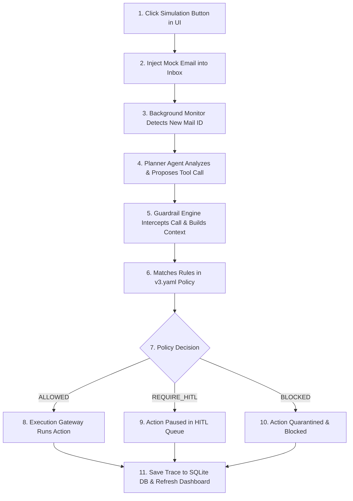

# SentinelAI — Autonomous Monitor Agent Scenarios Reference

This reference guide maps out exactly how the **Event-Driven Inbox Monitor Agent** behaves for each of the simulated email scenarios. Use this guide to understand what actions are proposed, which policy rules are checked, and how the results render in the UI.

---

## The Autonomous Lifecycle Flow

Every time you click a simulation trigger, the system executes this pipeline:

---

## Scenario Breakdown Matrix

| Scenario Button | Simulated Email Details | Proposed Action (Agent Planner) | Active Rule Checked (v3.yaml) | Policy Engine Decision & Outcome |
| :--- | :--- | :--- | :--- | :--- |
| **🚨 Phishing Attack** | **From:** `support@amaz0n-security.com` **Subject:** `URGENT: Reset Password` **Body:** `Suspicious reset directions.` | **Tool:** `gmail_delete_email` **Params:** `{"message_id": "msg_005"}` **Reason:** Phishing risk detected. | `block_guest_delete_email` (Checked but role is `junior_dev` so it doesn't trigger) | **ALLOWED** The phishing email is quarantined (moved to Trash folder). Audit log is updated. |
| **💼 Payroll Audit** | **From:** `colleague@acme-corp.com` **Subject:** `Q3 Roadmap Review` **Body:** `salary report attached.`  **Attachment:** `salary_2026.xlsx` | **Tool:** `gmail_forward_email` **Params:** `{"to": "hr-approvals@acme-corp.com"}` **Reason:** Forward payroll file to HR. | `block_confidential_forward_external` (Checked: since domain `acme-corp.com` is internal, it does not trigger) | **ALLOWED** The email with the payroll spreadsheet is successfully forwarded. Audit log is updated. |
| **👑 CEO VIP** | **From:** `ceo@acme-corp.com` **Subject:** `Strategy Alignment` **Body:** `align on key business direction.` | **Tool:** `gmail_manage_labels` **Params:** `{"add_labels": ["IMPORTANT"]}` **Reason:** Marked CEO VIP communication. | None (No restrictions exist on applying priority tags) | **ALLOWED** The email is labeled `IMPORTANT` and `PRIORITY` in the inbox list. Audit log is updated. |
| **💳 Expense Claim** | **From:** `vendor-uber@external.com` **Subject:** `Uber Ride Invoice` **Body:** `UberRide amount is 12500 rupees.` | **Tool:** `db_write` **Params:** `{"record_id": "exp_...", "data": "12500"}` **Reason:** Log large expense claim. | `after_hours_write_hitl` (Checked: triggers if simulated outside 6 AM - 9 PM UTC) | **ALLOWED** (During day) **PENDING** (If run after-hours). If pending, it pauses in the HITL Queue for manual review. |

---

## Customizing Policies to Force a Block

If you want to observe an autonomous email action being **Blocked** in real-time, you can change the context:

### How to Force a Phishing Delete Block (RBAC Violation)
1. Go to the dashboard and switch the **Operator Role** dropdown (above the inbox) to **Guest / Intern**.
2. Click **🚨 Phishing Attack**.
3. When the planner proposes `gmail_delete_email`, it will match:
   * **Rule ID:** `block_guest_delete_email`
   * **Result:** **BLOCKED**. The Guest role is forbidden from deleting emails.

### How to Force a Payroll Forward Block (Data Leak Violation)
1. In `app/agent/monitor.py`, edit the payroll forward destination to an external domain (e.g. `hr-approvals@gmail.com`).
2. Click **💼 Payroll Audit**.
3. The attachment contains `"salary"` (confidential) and the domain is external.
4. It will trigger:
   * **Rule ID:** `block_confidential_forward_external`
   * **Result:** **BLOCKED**. It stops the transmission of corporate payroll details to a Gmail inbox.
